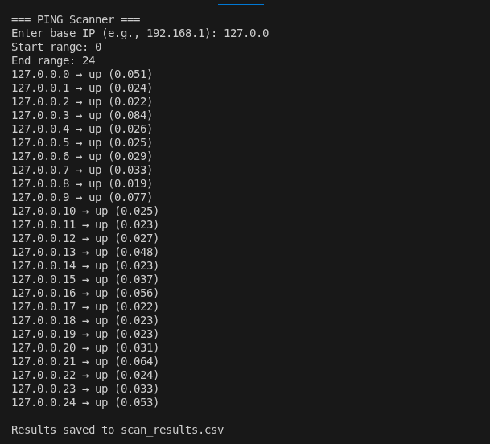
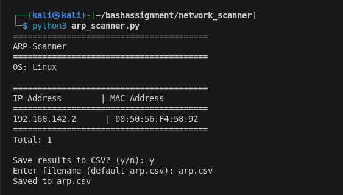

# Network Scanning Toolkit

## Project Description
This project consists of three Python-based network scanning tools designed for basic network analysis and monitoring.

Tools included:
1. Ping Scanner – Identifies active hosts in a given IP range.
2. ARP Scanner – Extracts IP and MAC address mappings from the ARP table.
3. Nmap Scanner – Performs host discovery, port scanning, and service detection using Nmap.

---

## How to Install Nmap

### On Linux (Ubuntu/Debian)
```bash
sudo apt update
sudo apt install nmap
```

### On Windows
1. Download Nmap from: https://nmap.org/download.html  
2. Run the installer and follow the setup instructions  
3. Ensure Nmap is added to system PATH  

### On macOS
```bash
brew install nmap
```

### Verify Installation
```bash
nmap -V
```

---

## How to Run Each Program

### Ping Scanner
```bash
python3 ping_scanner.py
```

### ARP Scanner
```bash
python3 arp_scanner.py
```

### Nmap Scanner
```bash
python3 nmap_scanner.py
```

---

## Example Usage

### Ping Scanner
```
=== PING Scanner ===
Enter base IP (e.g., 192.168.1): 192.168.1
Start range: 1
End range: 5

192.168.1.1 → up (10 ms)
192.168.1.2 → down (N/A)
192.168.1.3 → up (5 ms)
...
Results saved to Ping.csv
```

---

### ARP Scanner
```
----------------------------------------
ARP Scanner
----------------------------------------
OS: Windows

----------------------------------------
IP Address        | MAC Address
----------------------------------------
192.168.1.1       | AA:BB:CC:DD:EE:FF
192.168.1.2       | 11:22:33:44:55:66
----------------------------------------
Total: 2

Save results to CSV? (y/n): y
Saved to arp.csv
```

---

### Nmap Scanner
```
=== Nmap Scanner ===
Nmap is installed

Enter target IP or network: 192.168.1.0/24

Select scan type:
1. Basic Host Discovery (-sn)
2. Port Scan (1-1000)
3. Service Version Detection (-sV)

Enter choice (1-3): 2

Scanning...

PORT      STATE     SERVICE
80/tcp    open      http
22/tcp    open      ssh

Results saved to nmap_results.csv
```

---

## Output Files

| Tool          | Output File        | Description                        |
|--------------|------------------|------------------------------------|
| Ping Scanner | Ping.csv          | IP status and response time        |
| ARP Scanner  | arp.csv           | IP and MAC address mapping         |
| Nmap Scanner | nmap_results.csv  | Ports, states, and services        |

---

## Screenshots of Working Programs

Ping Scanner:


ARP Scanner:


Nmap (-sn) Scanner:
_output.png)

Nmap (port) Scanner:
_output.png)

Nmap (-sV) Scanner:
_output.png)


Note: Add your screenshots inside a `screenshots/` folder in your repository.

---

## Features
- Cross-platform support (Windows/Linux/macOS)
- CSV export for all tools
- Simple command-line interface
- Basic error handling

---

## Disclaimer
This project is intended for educational purposes only. Do not use these tools without proper authorization.

---
